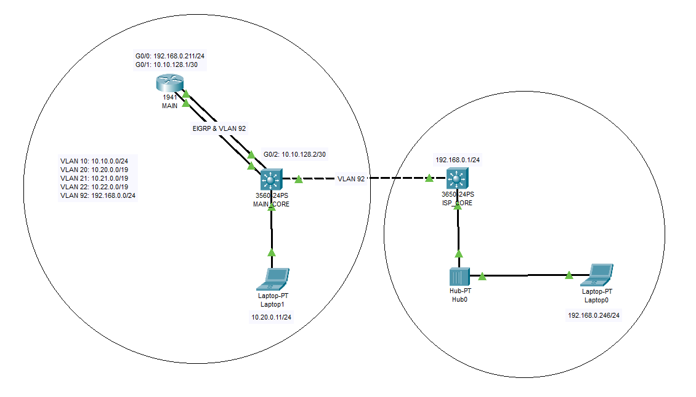
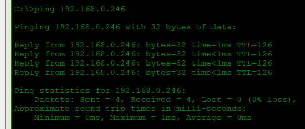

# ISP-VLAN-Routing-NAT-Experiment-with-Managed-Switch
This repository documents my study and configuration experiments for setting up an ISP connection over VLAN using a manageable switch. The goal is to route internet access through a VLAN-tagged WAN port while allowing internal VLANs (e.g., local network segments) to access the internet via Network Address Translation (NAT).

**It includes:**
   1. VLAN configuration for WAN and LAN interfaces
   2. Routing between VLANs
   3. NAT setup to enable internet access for local IP subnets
   4. Diagrams, config files, and test results

Useful for network engineers, homelab enthusiasts, or anyone experimenting with VLAN-based internet routing and NAT using managed switches and routers.

## 🧠 Objective

- Connect to the internet via a VLAN-tagged ISP WAN connection.
- Use a managed switch to separate network segments using VLANs.
- Route traffic between internal VLANs and out to the internet.
- Implement NAT (Network Address Translation) to allow internal (private) IP addresses to reach the internet through a single public IP.

## 📷 Network Diagram

## 🧰 Components Used

- **Managed Switch** (Cisco)
- **Router** (Cisco and TP-Link) 
- **ISP** providing internet on a specific VLAN tag (VLAN 92: 192.168.0.0/24)
- Multiple internal VLANs
- Application: Putty and Cisco Packet Tracer for configurations

---

## 🛠️ Configuration Overview

### 🖧 MAIN_CORE:
<pre>
#Creating VLAN on L3 Switch

conf t
vlan 10
  name vlan10-net
  exit
vlan 20
  name vlan20-net
  exit
vlan 92
  name vlan92-net
  exit

int vlan 10
  ip address 10.10.0.1 255.255.255.0
  no shut
  exit
int vlan 20
  ip address 10.20.0.1 255.255.224.0
  no shut
  exit
int vlan 92
  no shut
  exit

ip dhcp pool vlan20-pool
   network 10.20.0.0 255.255.224.0
   default-router 10.20.0.1
   exit
ip dhcp excluded-address 10.20.0.1 10.20.0.10

#Configure interface into access mode
interface giga0/1
   switchport access vlan 92
   switchport mode access
   exit
interface giga0/2
   no switchport
   ip address 10.10.128.2 255.255.255.252
   no shut
   exit
interface f0/1
   switchport access vlan 92
   switchport mode access
   exit
interface f0/2
   switchport access vlan 20
   switchport mode access
   exit
exit
write memory

#Configure Routing Protocol (EIGRP)
conf t
ip routing
ip route 0.0.0.0 0.0.0.0 10.10.128.1 #next hop ip (Cisco Router's IP address)
router eigrp 100
   no auto-summary
   passive-interface default
   network 10.10.128.0 0.0.0.3
   network 10.10.0.0 0.0.0.255
   network 10.20.0.0 0.0.3.255
   no passive-interface giga0/2
   exit
exit
write memory
</pre>

### 🖧 MAIN:
<pre>
#Configuring Routing, NAT, ACL and IP Address on MAIN Router

conf t
interface giga0/0
   ip address 192.168.0.211 255.255.255.0
   no shut
   ip nat outside
   exit
interface giga0/1
   ip address 10.10.128.1 255.255.255.252
   no shut
   ip nat inside
   exit
ip route 0.0.0.0 0.0.0.0 giga0/0
ip nat inside source list 100 interface giga0/0 overload
access-list 100 permit ip 10.20.0.0 0.0.3.255 any
#add to this access-list 100 those IP (VLAN) created if needed and also can deny

router eigrp 100
   no auto-summary
   passive-interface default
   network 10.10.128.0 0.0.0.3
   no passive-interface giga0/1
   exit
exit
write memory
</pre>
---
### Configured the other L3 Switch into VLAN 92 as well and pool 192.168.0.0/24
---
## 🧪 Testing
On Laptop1: IP: 10.20.0.11/24 GW: 10.20.0.1

pinged IP: 192.168.0.246

