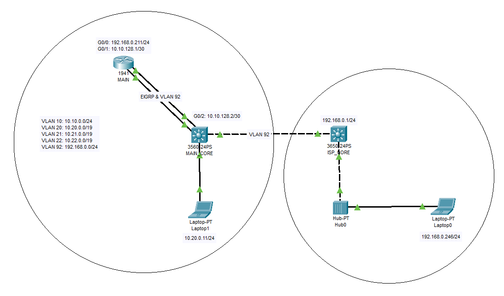

# ISP-VLAN-Routing-NAT-Experiment-with-Managed-Switch
This repository documents my study and configuration experiments for setting up an ISP connection over VLAN using a manageable switch. The goal is to route internet access through a VLAN-tagged WAN port while allowing internal VLANs (e.g., local network segments) to access the internet via Network Address Translation (NAT).

**It includes:**
   1. VLAN configuration for WAN and LAN interfaces
   2. Routing between VLANs
   3. NAT setup to enable internet access for local IP subnets
   4. Diagrams, config files, and test results

Useful for network engineers, homelab enthusiasts, or anyone experimenting with VLAN-based internet routing and NAT using managed switches and routers.

## 🧠 Objective

- Connect to the internet via a VLAN-tagged ISP WAN connection.
- Use a managed switch to separate network segments using VLANs.
- Route traffic between internal VLANs and out to the internet.
- Implement NAT (Network Address Translation) to allow internal (private) IP addresses to reach the internet through a single public IP.

## 📷 Network Diagram

## 🧰 Components Used

- **Managed Switch** (Cisco)
- **Router** (Cisco and TP-Link) 
- **ISP** providing internet on a specific VLAN tag (VLAN 92: 192.168.0.0/24)
- Multiple internal VLANs
- Application: Putty and Cisco Packet Tracer for configurations

---

## 🛠️ Configuration Overview

### 🖧 MAIN_CORE:
<pre>
#Creating VLAN on L3 Switch

conf t
vlan 10
  name vlan10-net
  exit
vlan 20
  name vlan20-net
  exit
vlan 92
  name vlan92-net
  exit

int vlan 10
  ip address 10.10.0.1 255.255.255.0
  no shut
  exit
int vlan 20
  ip address 10.20.0.1 255.255.224.0
  no shut
  exit
int vlan 92
  no shut
  exit
exit
write memory

</pre>

